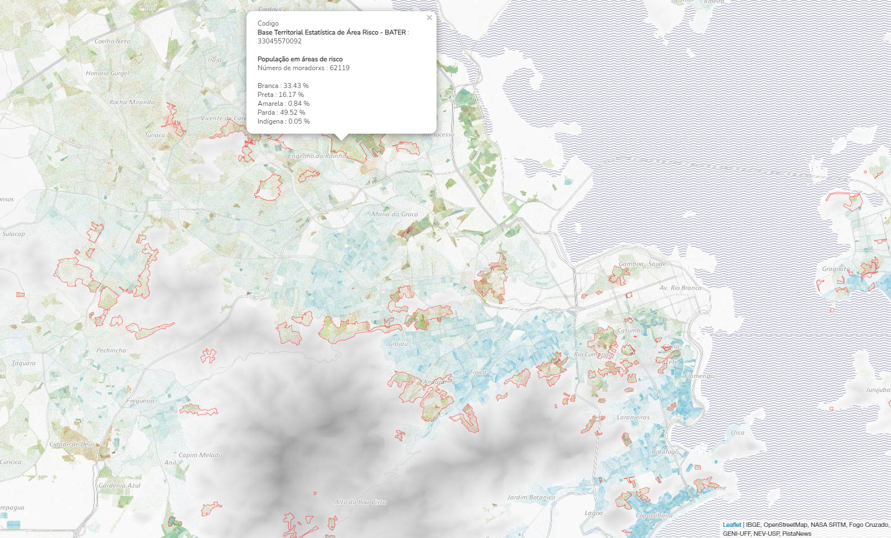

# Entenda a relação geográfica entre as áreas de risco e a raça/cor d(x)s morador(x)s das comunidades do Rio de Janeiro
Os mapas têm demonstrado a presença de desigualdade espacial produzida pela segregação racial dentro da região do Rio de Janeiro. Mas quais são as origens de risco enfrentadas pel(x)s morador(x)s?
Neste mapa, você pode ver alguns destes riscos. Não é perfeito, faltam muitas coisas, mas é uma forma de compreender a cidade, tentar definir as prioridades e construir estratégias.  

### O que você encontra no mapa base?
Cada ponto colorido representa um morador(a). A cor depende de como você respondeu à questão " de qual raça ou cor você é " para o censo de 2010 (Branco, Preto, Amarelo, Pardo ou Indígena). Os dados são antigos, mas já aguardamos o Censo Demográfico em 2021
### Quais níveis você pode consultar?
Os níveis que você encontra neste mapa são apenas algumas das possíveis origens de risco. Trabalhamos juntos para identificar outros níveis, relacioná-los e planejar a gestão desses riscos.
